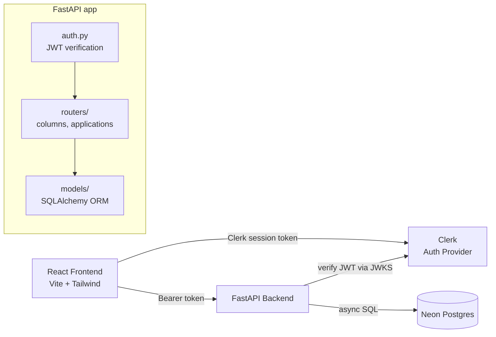

# JobPilot AI

An AI-powered job search workspace — a Kanban board for tracking applications, with Gmail integration, AI resume matching, cover letter generation, and interview prep, all in one place.

## Tech stack

### Frontend

| Tool | Why |
|---|---|
| **React + Vite** | Fast dev server, minimal config, standard choice for a SPA that needs to feel snappy while iterating on UI. |
| **Tailwind CSS v4** | CSS-first theming (`@theme` in `index.css`) instead of a JS config file — design tokens (`background`, `surface`, `foreground`, `amber`, `moss`, `mist`) live in one place and every component just references them by name. |
| **Clerk** | Handles auth end to end — sign-up, sign-in, session management, JWT issuing — so we're not hand-rolling password hashing, email verification, or session storage. Also gives the backend a clean way to verify "who is this request from" via JWKS, without either side needing to share secrets directly. |
| **React Router** | Standard client-side routing for `/`, `/sign-in`, `/sign-up`, `/dashboard`. |
| **Framer Motion** | Used specifically for the animated status-ticker on the auth page (cards fading/sliding as they cycle) — the one place motion needed to feel deliberate rather than just a CSS transition. |

### Backend

| Tool | Why |
|---|---|
| **FastAPI** | Async-native, and pairs naturally with Clerk: every route can `Depends()` on a JWT-verification function that runs before the route body, so auth is enforced declaratively rather than checked manually in every handler. Auto-generates interactive API docs (`/docs`) for free, which mattered a lot during development. |
| **SQLAlchemy 2.0 (async) + asyncpg** | Async ORM matching FastAPI's async model end to end — no blocking database calls holding up the event loop. `asyncpg` specifically because it's the fastest Postgres driver available for Python's asyncio. |
| **Neon (Postgres)** | Free tier, hosted, no server to maintain. Its pooled connection endpoint matters specifically for a backend like this that opens many short-lived connections (one per request) — the pooler multiplexes them so we don't exhaust Postgres's raw connection limit. |
| **PyJWT + JWKS** | Verifies Clerk's session tokens using Clerk's published public keys — the backend never sees or stores a password or session secret; it just checks a signature against a key Clerk rotates on its own. |
| **Pydantic (schemas)** | Every request/response is validated and shaped at the boundary — a card update either matches the expected shape or the client gets a clear 422 error, not a confusing downstream failure. |

## Architecture



The backend never stores a session itself — every request carries a fresh Clerk-issued token, verified independently each time. This keeps the API stateless: any request can be handled by any server instance with no shared session store needed.

## Database schema

### `board_columns`

| Column | Type | Notes |
|---|---|---|
| `id` | UUID (pk) | |
| `clerk_user_id` | string, indexed | Ties the row to a Clerk user — no local `users` table, Clerk owns identity |
| `name` | string | User-editable — "Applied", "Interview", or whatever they rename it to |
| `position` | float | Column order. Uses gapped values (0, 1024, 2048...) so reordering only ever touches the moved row, computing a midpoint between its new neighbors |
| `color` | string, nullable | Hex color for the status dot |
| `created_at` / `updated_at` | timestamp | |

### `applications` *(planned — next model to build)*

| Column | Type | Notes |
|---|---|---|
| `id` | UUID (pk) | |
| `clerk_user_id` | string, indexed | |
| `column_id` | UUID (fk → `board_columns.id`) | Which column the card sits in |
| `position` | float | Card order *within* its column — same gapped-position trick as columns |
| `company` / `role` | string | |
| `job_url` | string, nullable | |
| `notes` | text, nullable | |
| `source` | string | `"manual"` or `"gmail"` — lets the future Gmail-sync feature distinguish its own writes from ones the user made by hand |
| `applied_date` | timestamp, nullable | |
| `created_at` / `updated_at` | timestamp | |

**Relationship:** one `board_column` has many `applications` (`column_id` foreign key). Deleting a column with cards in it is blocked (`409 Conflict`), not cascaded — cards don't silently disappear.

## Project structure

```
backend/
├── app/
│   ├── main.py           — FastAPI app, CORS, router wiring
│   ├── config.py          — env var loading (DATABASE_URL, CLERK_ISSUER, ALLOWED_ORIGINS)
│   ├── databse.py          — async engine/session, get_db dependency
│   ├── auth.py              — verifies Clerk JWTs via JWKS, returns clerk_user_id
│   ├── schemas.py            — Pydantic request/response models
│   ├── models/                — one file per SQLAlchemy model
│   │   └── board_column.py
│   └── routers/                 — one file per resource
│       └── columns.py
└── scripts/
    └── create_tables.py          — dev-only schema bootstrap (swap for Alembic later)

frontend/
└── src/
    ├── App.jsx                — routes: /, /sign-in, /sign-up, /dashboard
    ├── main.jsx                 — ClerkProvider + BrowserRouter entry point
    └── components/
        ├── HomePage.jsx
        ├── SignInPage.jsx
        ├── SignUpPage.jsx
        ├── DashboardPage.jsx     — fetches and renders the board
        └── auth/
            ├── AuthLayout.jsx      — split-screen shell for sign-in/sign-up
            ├── StatusTicker.jsx     — animated activity feed on the auth panel
            └── clerkAppearance.js    — shared Clerk form theming
```

## Getting started

Backend and frontend run as two separate processes in local dev.

**Backend:** see `backend/README.md` for full Neon + Clerk setup. Short version:
```bash
cd backend
pip install -r requirements.txt
python -m scripts.create_tables
uvicorn app.main:app --reload
```

**Frontend:**
```bash
npm install
npm run dev
```

## Roadmap

- [x] Auth (Clerk sign-in/sign-up)
- [x] `board_columns` — customizable Kanban columns, seeded with defaults on first visit
- [ ] `applications` — the actual cards
- [ ] Drag-and-drop (cards between/within columns, columns reordering)
- [ ] Gmail integration — auto-create/move cards from recruiter emails
- [ ] AI resume matching
- [ ] AI cover letter generation
- [ ] Interview prep tools
- [ ] Application analytics